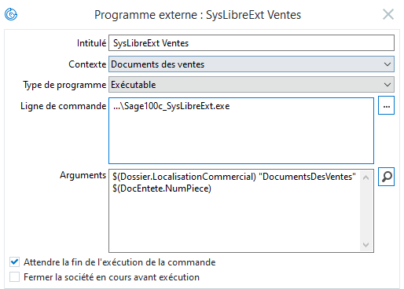

# sage100c-syslibre-ext
Improved "Informations libres" for Sage 100cloud

### Installation
- Execute the sql file *ZZ1_SysLibreExt.sql* to create the configuration table.
- Compile the project and place the exe file *Sage100c_SysLibreExt.exe* somewhere of your choice.
- Create an external program in Sage to reference this exe file:

- 3 parameters needs to be passed to the exe file:
  - path to the fcm file
  - contexte (same as Contexte field, without space, camel case)
  - related record id

### Usage
